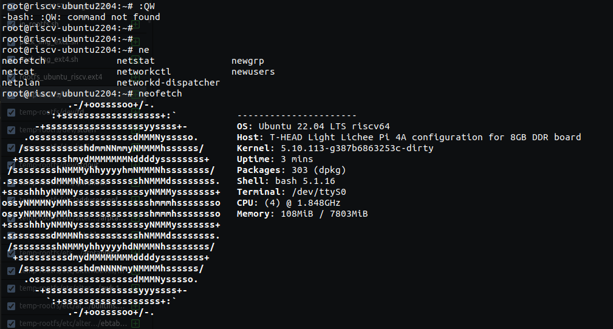

# Ubuntu22.04LTS-for-TH1520

基于th1520的ubuntu22.04系统，已内置nmcli。
账号：bango 密码：bango



## 文件说明

### in_rootfs.sh
 
 执行切换根目录，添加软件包用的

### pack_img_ext4.sh && pack_img_ext2.sh

 镜像打包脚本

 ## 添加软件包

 ### 1.挂载所需文件系统

 ```shell
cd Ubuntu22.04LTS-for-TH1520
sudo mount -t proc /proc  temp-rootfs/proc
sudo mount -t sysfs /sys  temp-rootfs/sys
sudo mount -o bind /dev  temp-rootfs/dev
sudo mount -o bind /dev/pts  temp-rootfs/dev/pts

./in_rootfs.sh

apt install [所需要的包]

sudo umount /dev/pts/ /dev/ /proc/ /sys

exit
 ```
 ### 2.添加内核模块

 在内核源码路径下运行：
 ```shell
 sudo make ARCH=riscv INSTALL_MOD_PATH=[项目路径]/Ubuntu22.04LTS-for-TH1520/temp-rootfs  modules_install

 ```

 ### 3.打包镜像以及烧录
./pack_img_ext4.sh
将生成的根文件系统替换烧录即可。